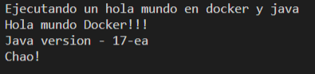

# Hola Mundo Docker y Java

## Requisitos

* tener instalado [docker desktop](https://docs.docker.com/desktop/windows/install/)
 * git

## Ejecuión

Clonar el repositorio
```
git clone https://github.com/juparog/HolaMundoDockerJava.git
```

Crear y ejecutar la imagen de docker
```
sh ./build-and_run_docker.sh
```

## Salida


